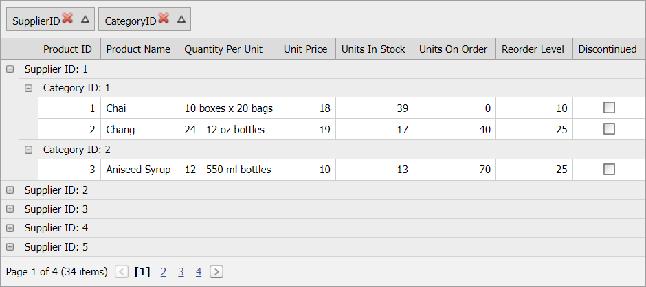

<!-- default badges list -->
[](https://supportcenter.devexpress.com/ticket/details/E5149)
[](https://docs.devexpress.com/GeneralInformation/403183)
<!-- default badges end -->
# Grid View for ASP.NET Web Forms - How to display ungroup buttons in column headers
<!-- run online -->
**[[Run Online]](https://codecentral.devexpress.com/e5149/)**
<!-- run online end -->
This example demonstrates how to display buttons that allow users to ungroup columns.



Define the [HeaderCaptionTemplate](https://docs.devexpress.com/AspNet/DevExpress.Web.GridViewColumn.HeaderCaptionTemplate) for columns with non-negative [group index](https://docs.devexpress.com/AspNet/DevExpress.Web.GridViewDataColumn.GroupIndex) to display ungroup buttons in headers of grouped columns:

```cs
protected void CreateUnGroupButton() { 
    foreach (GridViewDataColumn column in GridView1.DataColumns) {
        if (column.GroupIndex != -1) {
            column.HeaderCaptionTemplate = new MyTemplate();
        }
    } 
}

class MyTemplate: ITemplate {
    public void InstantiateIn(Control container) {
        GridViewHeaderTemplateContainer gridContainer = (GridViewHeaderTemplateContainer)container;
        string fieldName = (gridContainer.Column as GridViewDataColumn).FieldName;

        Literal caption = new Literal();
        caption.ID = "caption_" + gridContainer.ItemIndex.ToString();
        caption.Text = fieldName;
        container.Controls.Add(caption);

        ASPxImage image = new ASPxImage();
        image.ID = "unGroup_" + gridContainer.ItemIndex.ToString();
        image.ImageUrl = "~/Delete.png";
        image.ToolTip = "UnGroup column";
        container.Controls.Add(image);

        image.ClientSideEvents.Click = string.Format("function(s, e){{ gridView.UnGroup ('{0}'); }}", fieldName);
        image.ClientSideEvents.Init = "OnImageInit";
    }
}
```

Handle the button's client-side `Init` event to prevent the Grid View from sorting data when a user clicks this button:

```js
function OnImageInit(s, e) {
    var element = s.GetMainElement();
    element.onmousedown = element.onmouseup = function (event) {
        event.cancelBubble = true;
        return false;
    };
}
```

## Files to Review

* [Default.aspx](./CS/WebSite/Default.aspx) (VB: [Default.aspx](./VB/WebSite/Default.aspx))
* [Default.aspx.cs](./CS/WebSite/Default.aspx.cs) (VB: [Default.aspx.vb](./VB/WebSite/Default.aspx.vb))

## Documentation

- [Group Data in Grid View](https://docs.devexpress.com/AspNet/3715/components/grid-view/concepts/group-data)
- [Grid View Examples](https://docs.devexpress.com/AspNet/3768/components/grid-view/examples)

## More Examples

- [How to display group summary in group headers](https://github.com/DevExpress-Examples/asp-net-web-forms-grid-display-group-summary-in-group-headers)
- [How to select/deselect all rows in a group when data is grouped by one column](https://github.com/DevExpress-Examples/asp-net-web-forms-gridview-select-deselect-all-rows-in-a-group)
